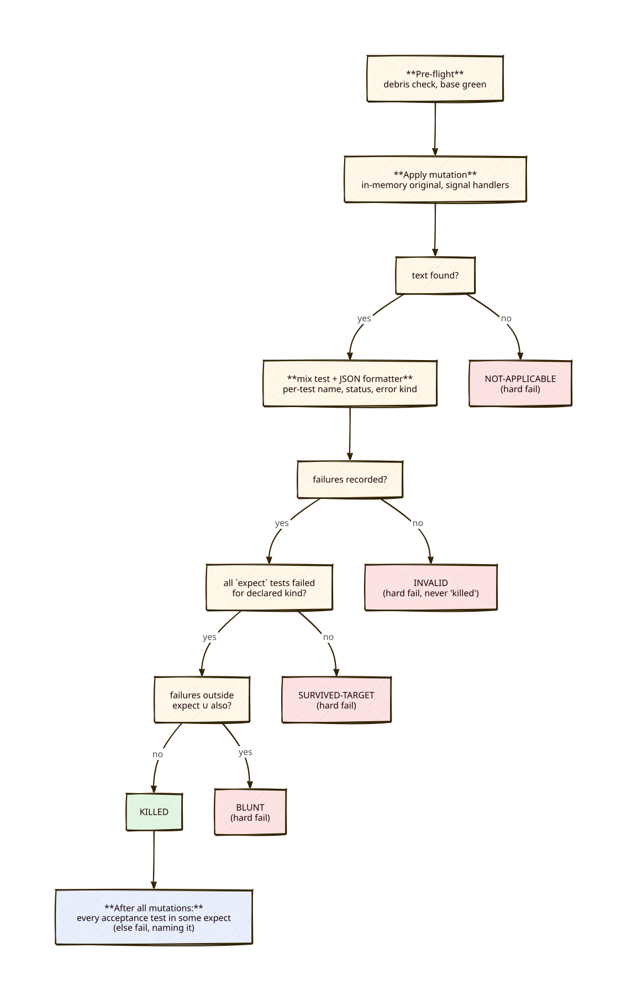

# Mechanical checks to replace rules that do not transfer (Greta, 2026-09-30)

**Status:** design only. Becomes its own slice after M1-d. Nothing here is built yet.
**Premise (Horst):** a check that cannot be forgotten beats a rule that has to be remembered. The rules that never came back are the ones we turned into tooling.
**Counter-premise (mine):** a noisy check gets switched off, and then it is worse than the rule. So each check below says how often it will cry wolf, measured where possible.

## Ranking

| Rank | Check | Replaces rule | Value | Cost | False positives |
|---|---|---|---|---|---|
| 1 | **C2** — a shared mutation library where each mutation declares the tests it must kill, and anything that is not a test failure counts as INVALID | "fail the test it claims, for its reason"; my ENFILE false kills | very high | S–M, done once | low |
| 2 | **C3a** — every acceptance row is killed by at least one mutation (the coverage map, built into C2) | vacuous assertions (partly) | high | ~0 on top of C2 | low |
| 3 | **C5** — the deviation table is checked against the golden fixture | "check COMPATIBILITY against the oracle" | high | M per slice | very low |
| 4 | **C1a** — test helpers that serialise data accept only ordered data (lists or keyword lists) | map-order test data (the DummyLM case) | medium–high | XS | none |
| 5 | **C3b** — a narrow lint for three known vacuous forms | vacuous assertions (the rest) | medium | XS | low if kept narrow |
| 6 | **C4** — duplicate detection, only on the files a slice touches | several copies of one thing | medium | S | medium |
| ✗ | **C1b** — a lint for "order matters" over map enumeration in `lib/` | map order (the B2 case) | — | — | **high: 29 sites to triage.** Not worth it |
| ✗ | **C1c** — run the suite with a perturbed atom table | map order | — | unknown | **Spike only**: I do not know whether atom creation order can be perturbed before the app starts under `mix test` |

A shared point: C2, C3a and C5 all live in **one committed library** (`plan/research/harness/mutlib.py` plus an ExUnit JSON formatter), not in per-slice copies. Today every slice copies its harness. That is itself the "several copies" problem (C4), and it is why fixes such as the SIGTERM handlers from H14 do not carry over to the next slice's harness.

## Diagram

---

## C2 — a mutation must fail the tests it claims, for its reason (rank 1)

**Contract.** Each mutation declares:
- `expect`: the tests that **must** fail, by exact test name;
- optionally `also`: other tests that may legitimately fail as collateral;
- optionally `kind`: `assertion`, or `raise:<Module>`.

The harness runs `mix test` with a small **JSON formatter** that writes, for each test, its name, its status and the error kind. Nobody parses console text any more; M1-d's harness matched a `Result:` regex against console output. Verdict per mutation:

| Observed | Verdict |
|---|---|
| every `expect` test failed, for the declared `kind`; no failure outside `expect ∪ also` | KILLED |
| some `expect` test passed | **SURVIVED-TARGET** (hard fail), even if other tests failed |
| failures outside `expect ∪ also` | **BLUNT** (hard fail): the mutation proves nothing precise |
| non-zero exit with no failing test recorded (compile error, ENFILE, VM crash); or the formatter's JSON is missing | **INVALID** (hard fail, never counted as killed) |
| the text to mutate was not found | NOT-APPLICABLE (hard fail, as now) |

Everything already required stays built into the library, so no harness can drop it again: in-memory originals restored in `try/finally`, SIGTERM/SIGHUP handlers, the debris pre-flight, the base-green check, and the count reconciliation.

- **Catches:**
  - M1-d's M1 claimed rows 1 and 15 but was only killed by row 1: SURVIVED-TARGET.
  - My two ENFILE "kills" with no test named: INVALID.
  - The M1-c "kills half the suite" cases: BLUNT.
- **Misses:** a wrong `expect` written in good faith. The expectation is still human. The table makes it reviewable, but it does not make it right.
- **False positives:** real collateral failures. An author then has to add them to `also`, which is a small cost and makes them visible, and that is good.
- **Cost:** about 150 lines of Python plus about 40 lines for the formatter, once. Existing harnesses migrate when they are next touched. The JSON formatter also makes C3a possible.

## C3 — vacuous assertions

### C3a — row-coverage map (rank 2, built into C2)
Every test in the slice's acceptance files must appear in the `expect` list of **some** mutation. Otherwise the harness fails and names that test.

- **Catches:**
  - Row 9b: no honest mutation of `raw_answer` can turn `nil or is_binary(...)` red, so either nobody claims row 9b (flagged), or somebody claims it and that mutation survives (SURVIVED-TARGET).
  - The `Enum.all?([], …)` case in the same way.
- **Misses:**
  - A row claimed by a mutation that kills it **for a different assertion** in the same test. For example, row 9b also asserts `e.reason != nil`, so a mutation that drops the reason kills 9b while the `raw_answer` line stays vacuous.
  - Mitigation: `kind` plus reviewing the `expect` table. This is partial; I cannot make it complete mechanically.
- **False positives:** rows that are genuinely not mutation-testable, such as a "suite green" row. Allow an explicit `exempt: {row, reason}` list, printed in every report so it stays visible.
- **Cost:** about 20 lines inside C2.

### C3b — narrow lint for known vacuous forms (rank 5)
A `grep`-level check over the slice's **new** test files only. It flags:
1. `assert … == nil or …` / `assert … or is_…` — a disjunction inside an assert.
2. `rescue` / `catch` inside a `test` block whose result is then ignored. Row 12 swallows `JudgeError`, which hid the fact that decompositional mode was never shown to work.
3. `assert Enum.all?(x, …)` without an `assert x != []` or `assert length(x) > 0` on the same variable in the same test.

Measured today: **8** hits for forms 1 and 2 across `test/`, **22** `assert Enum.all?` hits. Run over only the files a slice adds, that is a handful per slice.

- **Misses:** vacuity it has no pattern for, such as comparing a value with itself, or asserting on a fixture instead of the output.
- **False positives:** a legitimate `rescue` that asserts on the exception. So allow an inline `# vacuity-ok: <why>`.
- **Keep it this narrow on purpose.** A broad "suspicious assertion" lint would be the noisy check that gets turned off.

## C5 — COMPATIBILITY claims against the oracle (rank 3)

The generator already writes the upstream verdict for each case. Add one committed file per slice: `deviations.json`, a list of `{case_id, upstream, ours, reason}` entries.

- **A test** takes every fixture case where our observed result (produced in the test) differs from upstream's, and asserts that this set **equals** the set of `case_id`s in `deviations.json`. That catches a claimed deviation that does not exist (the H12 NaN/inf row for `:integer`) and a real deviation nobody declared.
- **The COMPATIBILITY section** is either generated from `deviations.json` (a small `mix` task that writes a marked region), or a test checks that every `case_id` has a row there and vice versa. I recommend the check rather than generation, so the prose stays hand-written and only the facts are checked.
- **Catches:** all three false H12 statements were about which cases deviate and for which type, and that is exactly this set comparison.
- **Misses:**
  - Claims about cases missing from the fixture.
  - Wrong prose about *why* a case deviates.
- **False positives:** almost none. Both sides are data.
- **Cost:** M the first time (the test pattern plus the doc check); S per slice after that. It needs the generator to name each case with a stable `case_id`. The M1-b, M1-c, H12 and M1-d generators do not all do that today.

## C1 — map-order-dependent test data

### C1a — serialising helpers accept only ordered input (rank 4)
Any test helper that turns a map into ordered output (wire text, CSV lines, prompts) takes a **list or keyword list** and raises `ArgumentError` on a map with more than one key. For DummyLM: `DummyLM.new([[reasoning: "r", precision: 0.8, recall: 0.6]])`. Measured: `test/support/` has exactly one such helper today (`dummy_lm.ex:104-108`).

- **Catches:** the M1-d case at the moment it is written. A map in the script raises immediately instead of passing by chance.
- **Misses:**
  - Helpers written later without the guard.
  - Order dependence in `lib/` (the B2 case).
  - Mitigation: C3b-style lint item 4 — `Enum.map`/`Enum.join` over a map inside `test/support/` — which has 1 hit today, so it is not noisy.
- **Cost:** XS. Rewriting the M1-d scripts is mechanical.

### C1b — lint over `lib/`: not recommended
The B2 class: enumerating a map to produce ordered output such as a CSV header. `Map.keys/values/to_list` alone appears **29 times** in `lib/`, and most are harmless. A lint would need someone to judge each site and add waivers. That is the noisy check that gets switched off. Keep this as a **review question** instead: "does output order come from a map?" It is one line on the reviewer checklist.

### C1c — perturbed atom table: spike, not a plan
The idea: run the suite a second time with atoms created in a different order, so map-order luck changes. **I do not know whether this is achievable.** Under `mix test` the application and its modules load, and create atoms, before `test_helper.exs` runs. A 1-hour spike would answer it: try creating the test-file atoms in reverse order through `ERL_FLAGS`/`-eval` before boot, and see whether the M1-d DummyLM order changes. If it works, it is the only check that also catches the `lib/` cases. If not, drop it.

## C4 — several copies of one thing (rank 6)
The project has no Credo (`.credo.exs` is absent, and Credo is not in `mix.exs`). Options:
- **(a)** Add Credo only for `Credo.Check.Design.DuplicatedCode`, run on the files the slice touches. I believe this check exists and is off by default, but that is **not verified**. It detects by AST mass, so a one-line `clamp01` sits below any sensible threshold; M1-d's 8-line `f1`, and the H12 parsers, would be caught.
- **(b)** A small script: normalise each `defp`/`def` body (strip names, whitespace and literals) and report bodies that match across `lib/`. It catches one-liners too, but it also flags trivial delegations such as `parameters/1`, which are legitimately repeated.

- **Catches:** M1-d's `f1`, and the H12 parser copies.
- **Misses:** copies that diverged slightly, which are the dangerous ones, because the second copy is where the bug fix did not land.
- **False positives:** medium: struct boilerplate and delegations.
- **Recommendation:** (a), limited to changed files and reported as a **warning in the review packet**, not a gate. Here a gate would get switched off.

## What stays a rule (not worth mechanising)
- Choosing the *right* expectations for a mutation (C2, C3a): it can be reviewed, but it cannot be checked.
- Whether a threshold row sits on the side of the threshold that tells pass from fail (M1-d point 4). A boundary row can be required by convention (`score == threshold` in every threshold suite), but deciding which boundaries matter is judgement.
- Dates come from `date`/`git log`. A grep for future dates in new docs is possible, but low value.

## Open questions for Horst
- Should C2's library be retro-fitted to the M1-b, M1-c and H12 harnesses in the same slice, or only when each is next touched? I recommend next-touch, except M1-d, whose fix round should adopt it directly.
- Is C5's per-slice `deviations.json` acceptable as a new required artifact on the team card?
